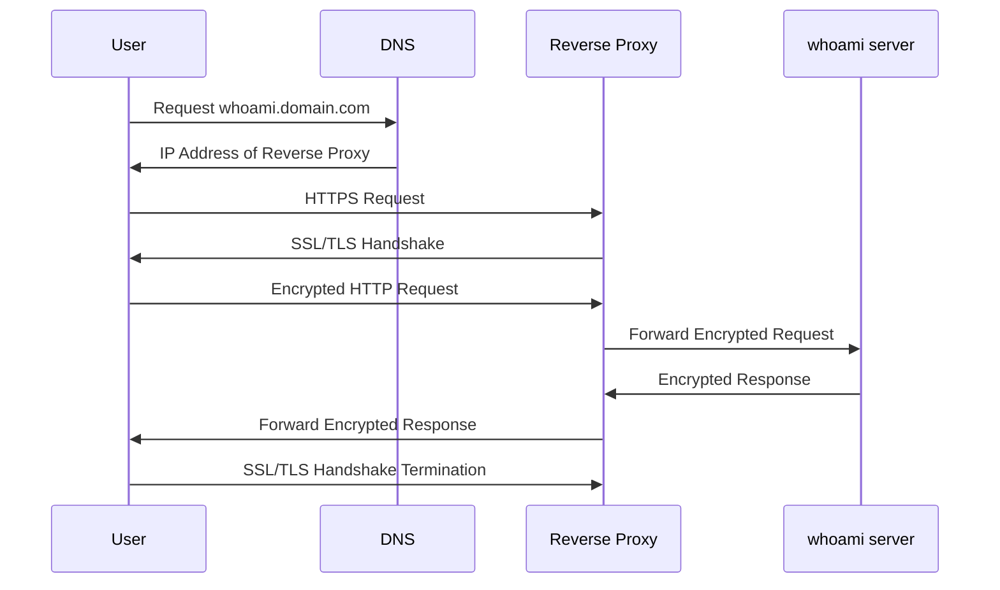

# Certificate



當使用者在瀏覽器的 URL 列中鍵入網域名稱時，DNS 伺服器負責將這些網域名稱轉換為數字 IP 位址，從而引導他們存取正確的網站。

## Install DNS

```
# 建立 dnsmasq
docker compose up -d
```

## Install CERT MANAGER

```
# 建立 k3d 和憑諝管理
k3d cluster create dev-reddtsai-org --api-port 6550 --port 80:80@loadbalancer --port 443:443@loadbalancer --agents 1
helm repo add jetstack https://charts.jetstack.io --force-update
helm install cert-manager jetstack/cert-manager --namespace cert-manager --create-namespace --version v1.16.1 --set crds.enabled=true
```

Verify

```
kubectl get issuer -o wide
kubectl get certificateRequest -o wide
kubectl get certificates
kubectl describe secret <secret name>
```

測試 Demo

```
# -k: 忽略 SSL 憑證錯誤；-H: 請求的 Host 頭部(代替DNS)；-L: 會自動跟隨重定向；
curl -kivL -H 'Host: whoami.reddtsai.org' 'http://192.168.1.110'
```

CRD

```
kubectl get crd certificaterequests.cert-manager.io
kubectl apply -f https://github.com/cert-manager/cert-manager/releases/download/v1.16.1/cert-manager.yaml
```
