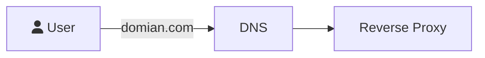

# DNS



當使用者在瀏覽器的 URL 列中鍵入網域名稱時，DNS 伺服器負責將這些網域名稱轉換為數字 IP 位址，從而引導他們存取正確的網站。

## Install With Docker

```
# 建立 dnsmasq
docker compose up -d
# 建立 k3d 和憑諝管理
k3d cluster create dev-reddtsai-org --api-port 6550 --port 80:80@loadbalancer --port 443:443@loadbalancer --agents 1
helm repo add jetstack https://charts.jetstack.io --force-update
helm install cert-manager jetstack/cert-manager --namespace cert-manager --create-namespace --version v1.16.1 --set crds.enabled=true
```

測試 Demo

```
# -k: 忽略 SSL 憑證錯誤；-H: 請求的 Host 頭部(代替DNS)；-L: 會自動跟隨重定向；
curl -kivL -H 'Host: whoami.reddtsai.org' 'http://192.168.1.110'
```

## Use Clound DNS

AWS Route 53:
由 Amazon Web Services 提供的雲端 DNS 服務，支持全球的高可用性和擴展性。

Google Cloud DNS:
由 Google Cloud 提供的高效、可靠的 DNS 服務，具有低延遲和高可用性。

Azure DNS:
由 Microsoft Azure 提供的 DNS 服務，可將域名解析為 Azure 服務的 IP 地址。

Cloudflare DNS:
提供免費和付費的 DNS 服務，具有高性能和強大的 DDoS 防護。

Dyn Managed DNS:
Oracle 提供的 DNS 服務，以其高可用性和可靠性著稱。
